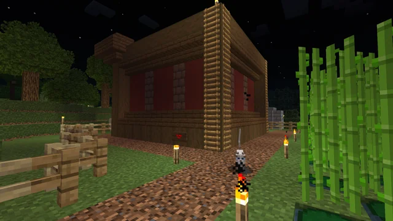

.. Mood game documentation master file, created by
   sphinx-quickstart on Wed Apr  9 11:38:17 2025.
   You can adapt this file completely to your liking, but it should at least
   contain the root `toctree` directive.

Mood game documentation
=======================

Многопользовательская игра "Коровий MUD".
Игроки ходят по полю, встречают монтсров и атакуют их.
Случайный монстр каждые 30 секунд двигается на 1 клетку.

.. toctree::
   :maxdepth: 2
   :caption: Contents:

   API_SERVER
